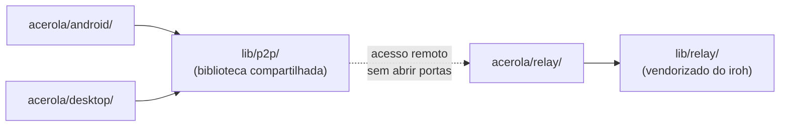

# Acerola

Ecossistema de leitura de quadrinhos/mangás locais com sincronização 100% P2P entre dispositivos — sem servidor central, sem conta, sem nuvem.

Este é um monorepo: cada plataforma vive isolada em `acerola/`, com sua própria stack e seu próprio README completo. Nenhuma plataforma depende diretamente de outra — todas consomem as bibliotecas compartilhadas em `lib/` via dependência `path` local (não git), então uma mudança em `lib/p2p/` já reflete direto nos consumidores sem precisar publicar/atualizar nada.

## Ferramentas necessárias

- [`cargo-make`](https://github.com/sagiegurari/cargo-make) (`cargo install cargo-make`) — usado pelos crates Rust individualmente (veja o `CONTRIBUTING.md` de cada plataforma) e pelas tarefas de manutenção do monorepo inteiro, definidas no [`Makefile.toml`](Makefile.toml) da raiz. Com ele instalado: `cargo make clean` limpa o `target/` de todos os crates Rust do repo (`lib/p2p`, `lib/relay`, `acerola/desktop/src-tauri`, `acerola/android/native/rust`) de uma vez.

| Pasta | Plataforma | Stack | Leia mais |
| --- | --- | --- | --- |
| [`acerola/android/`](acerola/android/README.md) | App Android nativo | Kotlin + Jetpack Compose | [acerola/android/README.md](acerola/android/README.md) |
| [`acerola/desktop/`](acerola/desktop/README.md) | App Desktop | Rust + Tauri + Svelte 5 | [acerola/desktop/README.md](acerola/desktop/README.md) |
| [`acerola/relay/`](acerola/relay/) | Serviço + UI de monitoramento do relay (deployável na VPS) | Rust — ainda não iniciado | — |
| [`lib/p2p/`](lib/p2p/README.md) | Biblioteca P2P compartilhada | Rust (iroh / QUIC) | [lib/p2p/README.md](lib/p2p/README.md) |
| [`lib/relay/`](lib/relay/) | Código do relay iroh vendorizado, base para `acerola/relay/` | Rust | — |

## Instalação

- **Android**: APK assinado, disponível nos [GitHub Releases](https://github.com/Vinicius-Gabriel-P-Leitao/acerola-reader/releases). Ainda não publicado na Play Store.
- **Desktop (Windows)**: só o pacote da **Microsoft Store** é assinado com certificado confiável. Os binários soltos publicados nos GitHub Releases (`.exe`, `.msi`, `.msix`) **não têm certificado** — o Windows SmartScreen vai avisar ao instalar.

## Como as peças se conectam

`acerola/android/` e `acerola/desktop/` nunca se enxergam diretamente — cada um implementa sua própria FFI/binding para consumir `lib/p2p/`. Toda comunicação entre dispositivos é P2P direta (LAN via mDNS) ou via o relay (`acerola/relay/`, construído sobre `lib/relay/`) quando fora da mesma rede.

## Documentação

- Como contribuir: [CONTRIBUTING.md](CONTRIBUTING.md)
- Política de privacidade: [PRIVACY_POLICY.md](PRIVACY_POLICY.md)
- Licença: [LICENSE](LICENSE) (MPL-2.0, para todo o monorepo)
- TODO de cada plataforma: `acerola/android/TODO.md`, `acerola/desktop/TODO.md`, `lib/p2p/TODO.md`
- Assets usados nos READMEs (GitHub): [`docs/github/`](docs/github/)
- Futuro site de documentação: [`docs/web/`](docs/web/) (ainda vazio)
