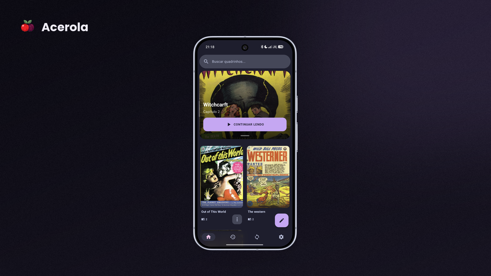
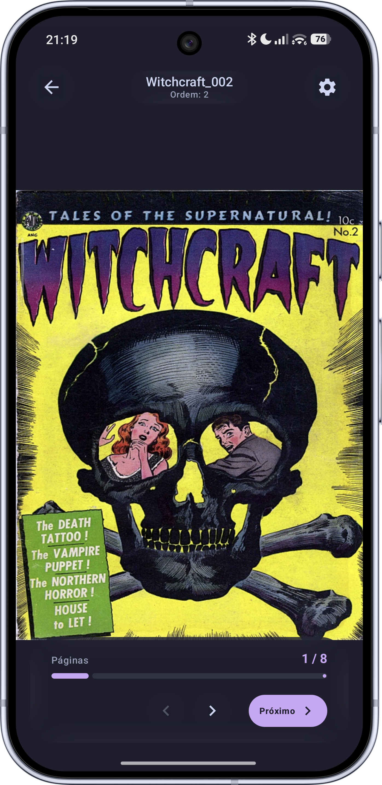
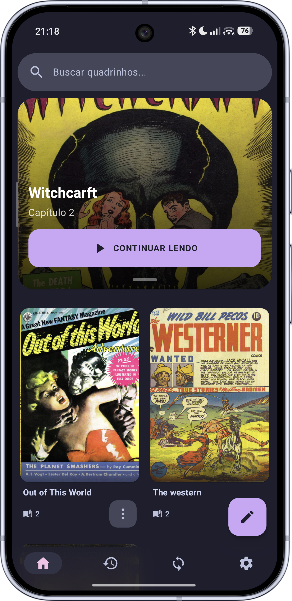
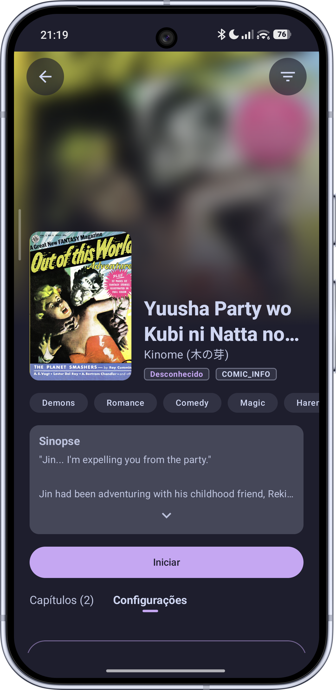
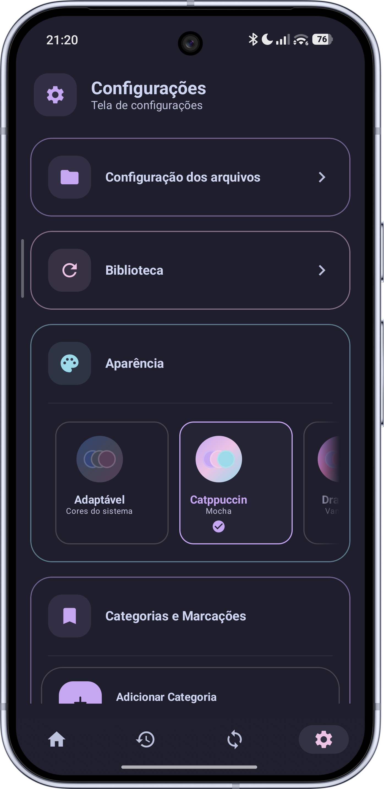
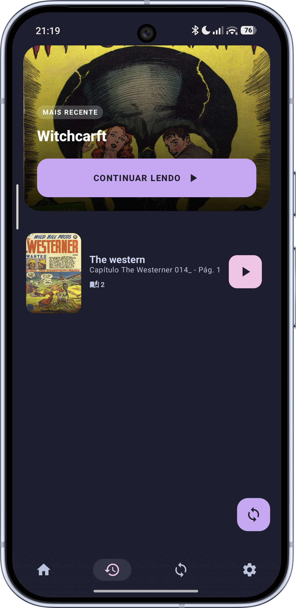
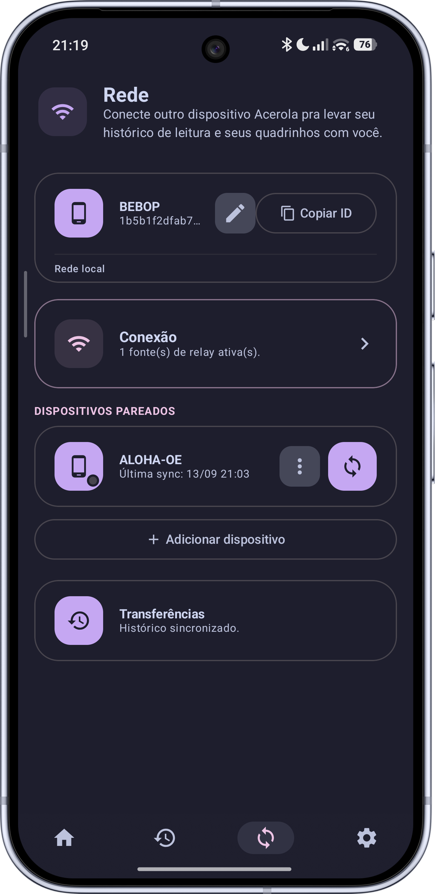
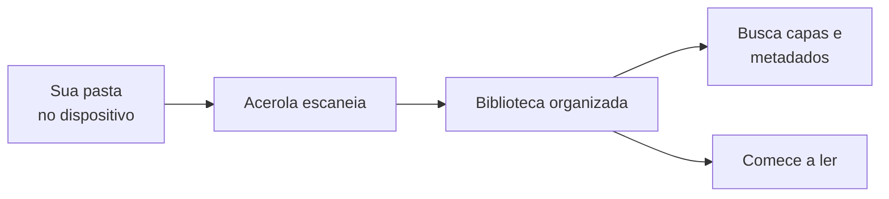
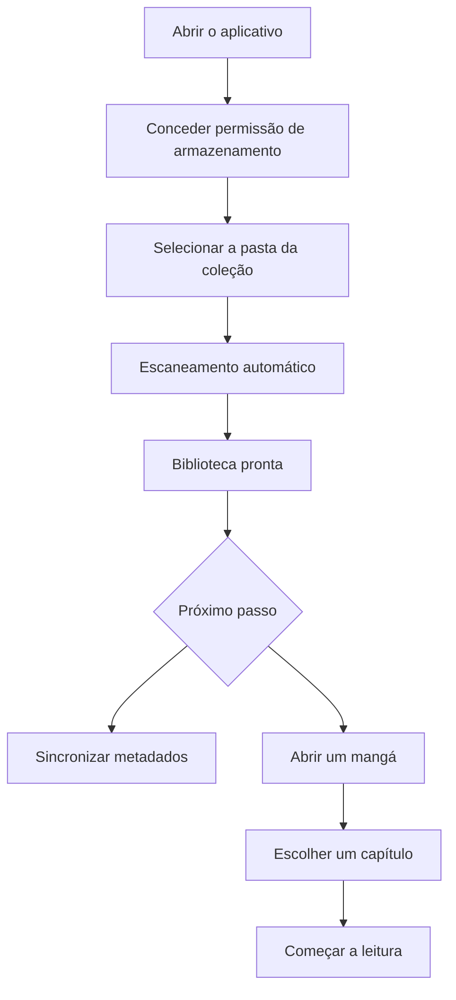

# acerola-android

Acerola é um leitor de mangá para Android focado em coleções locais. Basta apontar para uma pasta no dispositivo que o aplicativo encontra os arquivos, organiza automaticamente sua biblioteca e deixa tudo pronto para leitura.

---

## Preview

  

---

## Galeria

<table>
  <tr>
    <td rowspan="3" valign="top" align="center">
       
      <b>Leitura</b>
    </td>
    <td align="center">
       
      <b>Home</b>
    </td>
    <td align="center">
       
      <b>Capítulos</b>
    </td>
    <td align="center">
       
      <b>Configurações</b>
    </td>
  </tr>

  <tr>
    <td align="center">
       
      <b>Histórico</b>
    </td>
    <td align="center">
       
      <b>Rede</b>
    </td>
    <td></td>
  </tr>
</table>

---

---

## Funcionalidades

* **Biblioteca**

  * Escaneia automaticamente uma ou mais pastas.
  * Detecta novos arquivos.
  * Visualização em grade ou lista.
  * Busca rápida.
  * Organização por categorias.

* **Metadados**

  * Busca automaticamente capa, sinopse, autor e gênero.
  * Integração com MangaDex, AniList e ComicInfo.
  * Alteração manual das informações.
  * Troca da fonte de metadados quando desejar.

* **Leitura**

  * Suporte nativo para `.cbz` e `.cbr`.
  * Conversão automática de `.pdf` para `.cbz`.
  * Diversos modos de leitura.
  * Paginação configurável.
  * Salvamento automático do progresso.

* **Histórico**

  * Acesso rápido aos mangás lidos recentemente.

* **Personalização**

  * Temas Catppuccin.
  * Dracula.
  * Alucard.
  * Nord.
  * Outras opções de customização da interface.

---

## Como funciona

1. Abra o aplicativo.
2. Conceda a permissão de armazenamento.
3. Escolha a pasta onde sua coleção está armazenada.
4. Aguarde o escaneamento automático.
5. Sincronize os metadados para baixar capas e informações.
6. Abra um mangá e comece a leitura.

---

## Formatos suportados

| Formato | Descrição                                                  |
| ------- | ---------------------------------------------------------- |
| `.cbz`  | Comic Book ZIP (ZIP contendo imagens)                      |
| `.cbr`  | Comic Book RAR (RAR contendo imagens)                      |
| `.pdf`  | Convertido automaticamente para `.cbz` na primeira leitura |

---

## Futuro do ecossistema

### acerola-desktop

O Acerola para Android fará parte do ecossistema **acerola-desktop**, permitindo que a biblioteca seja compartilhada entre computador e celular.

Os recursos planejados incluem:

* Biblioteca do computador acessível diretamente pelo Android.
* Sincronização de progresso de leitura.
* Sincronização de histórico.
* Envio de mangás entre dispositivos.
* Descoberta automática na mesma rede.
* Acesso remoto utilizando **acerola-relay**, sem necessidade de abrir portas no roteador ou configurar VPN.
