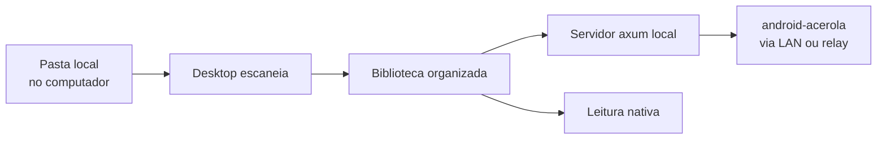
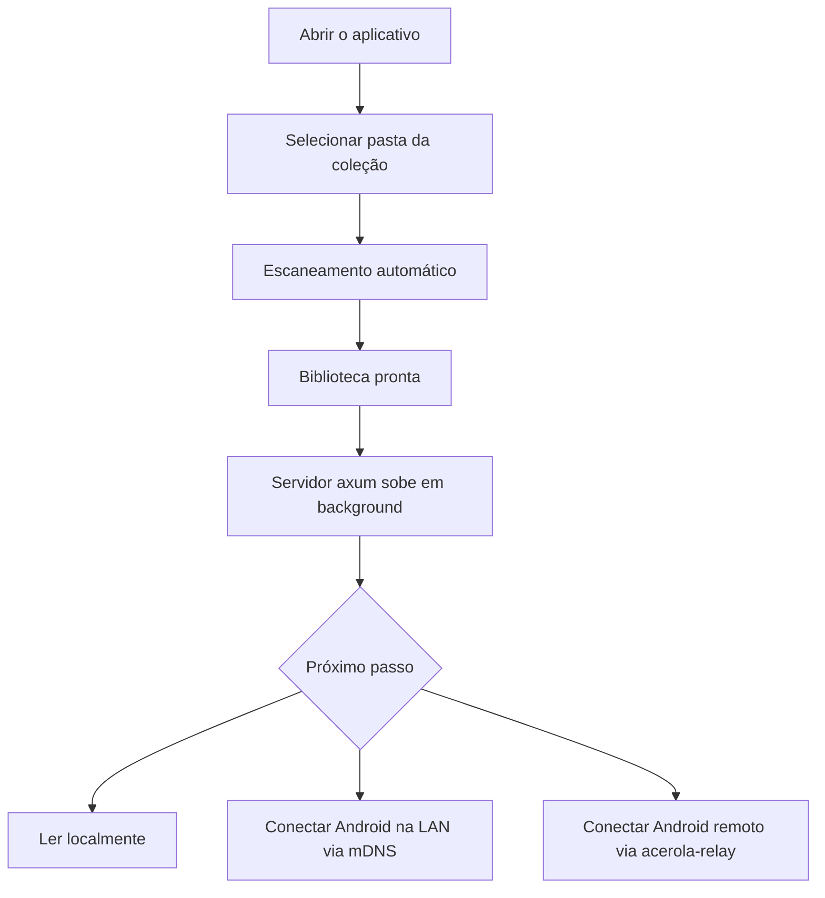

# acerola-desktop

Cliente desktop multiplataforma do ecossistema **acerola**. Aponte para uma pasta local com `.cbz`, `.cbr` ou `.pdf` e o app organiza a biblioteca, serve para o Android na rede e, opcionalmente, traduz com IA via plugin.

---

## Preview

  

  

  

> **Nota:** Os banners acima foram produzidos com auxílio de Inteligência Artificial e posteriormente refinados para representar a identidade visual e a experiência do acerola-desktop.

---

## Galeria

<table>
  <tr>
    <td rowspan="2" valign="top" align="center">
       
      <b>Leitura</b>
    </td>
    <td align="center">
       
      <b>Home</b>
    </td>
    <td align="center">
       
      <b>Configurações</b>
    </td>
  </tr>
  <tr>
    <td colspan="2" align="center">
       
      <b>Histórico</b>
    </td>
  </tr>
</table>

---

---

## Funcionalidades

- **Biblioteca**

  - Escaneia automaticamente uma ou mais pastas locais.
  - Detecta novos arquivos.
  - Deduplicação por hash BLAKE3.
  - Busca rápida e organização por categorias.

- **Leitura**

  - Suporte nativo para `.cbz` e `.cbr`.
  - Conversão automática de `.pdf` para `.cbz`.
  - Cache LRU por bytes + prefetch das próximas páginas.
  - Salvamento automático do progresso.

- **Conectividade com o Android**

  - Descoberta automática na mesma rede via mDNS (tier gratuito).
  - Acesso remoto via Iroh + acerola-relay, sem abrir portas no roteador (tier pago).
  - Sincronização bidirecional de biblioteca, histórico e progresso via GraphQL Subscriptions.

- **Tradução (opcional)**

  - Plugin conecta ao acerola-translator — selfhost ou servidor pago.
  - Progresso em tempo real via SSE durante a tradução.

- **Personalização**

  - Interface em Svelte 5 + Tailwind + shadcn-svelte.
  - Configuração de endpoints (translator e relay) direto nas configurações.

---

## Como funciona

1. Abra o aplicativo.
2. Selecione a pasta onde sua coleção está armazenada.
3. Aguarde o escaneamento automático da biblioteca.
4. O servidor local sobe automaticamente — o Android descobre via mDNS na LAN.
5. Fora da LAN, ative o relay pago nas configurações para acesso remoto.
6. Abra um mangá e comece a leitura, com progresso sincronizado entre dispositivos.

---

## Formatos suportados

| Formato | Descrição                                                  |
| ------- | ---------------------------------------------------------- |
| `.cbz`  | Comic Book ZIP (ZIP contendo imagens)                      |
| `.cbr`  | Comic Book RAR (RAR contendo imagens)                      |
| `.pdf`  | Convertido automaticamente para `.cbz` na primeira leitura |

---

## Conectividade — tier gratuito vs pago

| Tier     | Mecanismo                 | Requisito                       | Custo             |
| -------- | ------------------------- | ------------------------------- | ----------------- |
| Gratuito | mDNS + HTTP direto na LAN | Desktop e Android na mesma rede | Zero infra        |
| Pago     | Iroh + acerola-relay      | Conta no serviço, qualquer rede | Subscrição mensal |

Trocar entre os dois tiers é mudar uma URL nas configurações — o protocolo de aplicação (GraphQL, streaming de páginas) é idêntico nos dois casos.

---

## Ecossistema acerola

O acerola-desktop funciona sozinho, sem dependência do translator ou do relay. Quando conectado ao restante do ecossistema, atua como servidor local para o Android:

| Projeto            | Linguagem             | Papel                                       |
| ------------------ | --------------------- | ------------------------------------------- |
| android-acerola    | Kotlin                | Cliente que consome a biblioteca do desktop |
| acerola-desktop    | Rust + Tauri + Svelte | Este projeto — servidor local + leitor      |
| acerola-translator | Go + Python           | Serviço de tradução com IA                  |
| acerola-relay      | Rust + Svelte         | Coordenação P2P (tier pago)                 |

Licença MPL-2.0 — mesma licença de todo o ecossistema.
