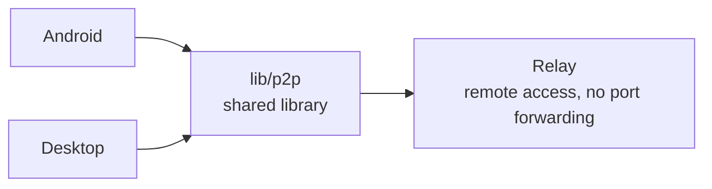
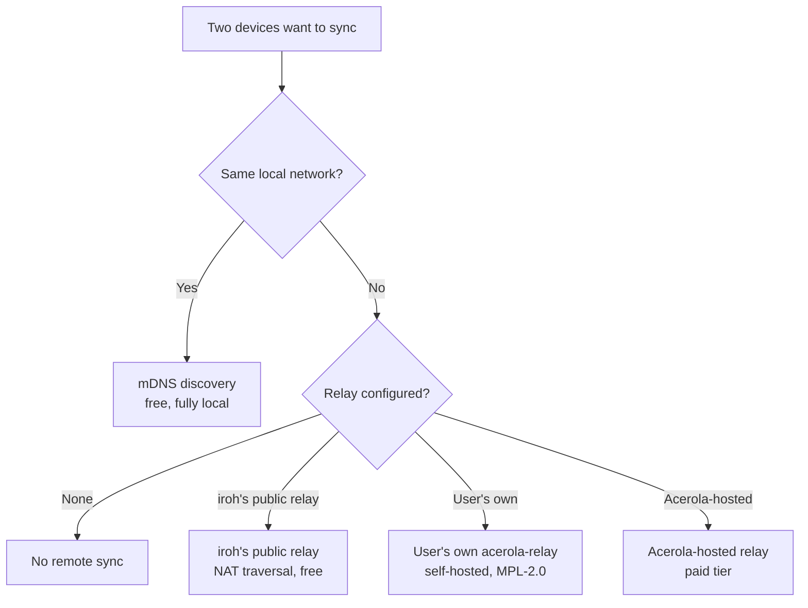

Acerola is a **monorepo**: each platform lives isolated, with its own stack, and none depends directly on another. They all consume the shared libraries in `lib/` via a local path dependency — a change in `lib/p2p/` already reflects directly in every consumer.

<CardGrid>
	<Card title="acerola/android">Kotlin + Jetpack Compose</Card>
	<Card title="acerola/desktop">Rust + Tauri + Svelte 5</Card>
	<Card title="acerola/relay">Remote access service (Rust) — not started yet</Card>
	<Card title="lib/p2p">Shared P2P library (iroh / QUIC)</Card>
	<Card title="lib/relay">Vendored iroh relay code</Card>
</CardGrid>

## How the pieces connect

`acerola/android/` and `acerola/desktop/` never see each other directly — each implements its own FFI/binding to consume `lib/p2p/`. All communication between devices is either direct P2P (LAN via mDNS) or through a relay when devices aren't on the same network.

## How sync works

Library, history, and reading progress sync directly between the user's own devices — no account, no central database. How the connection happens depends on where the devices are and what's been configured:

The four connectivity modes:

<CardGrid>
	<Card title="Local discovery (mDNS)">
		Default and free. Devices find each other on their own on the same Wi-Fi/LAN network — no traffic leaves the local network.
	</Card>
	<Card title="iroh's public relay">
		When devices aren't on the same network, <a href="https://iroh.computer" target="_blank" rel="noopener noreferrer">iroh</a>'s public infrastructure enables the connection (NAT traversal). It only forwards end-to-end encrypted QUIC traffic — it never sees the content.
	</Card>
	<Card title="User's own relay">
		Anyone can run their own instance of <code>acerola-relay</code> (open source, MPL-2.0) on their own VPS. No third-party infrastructure is involved.
	</Card>
	<Card title="Acerola-hosted relay">
		A paid alternative where the relay infrastructure is operated by the Acerola team — same end-to-end encryption guarantee as the other modes.
	</Card>
</CardGrid>

In all four cases the handshake and transport are the same (QUIC + TLS 1.3 via iroh) — only who brokers the connection changes when devices aren't on the same network. Details on what metadata each mode exposes live in the [Privacy Policy](/en/docs/privacy-policy).
