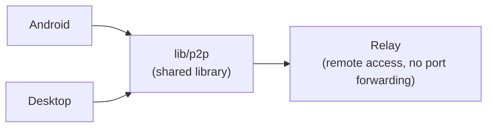

<Callout type="note" title="Example page">

This content is a placeholder to validate the documentation pipeline. The real architecture documentation is still being written.

</Callout>

Acerola is a **monorepo**: each platform lives on its own, with its own stack, and none depends directly on another. All of them consume the shared libraries in `lib/` via a local path dependency — a change in `lib/p2p/` immediately reflects in consumers.

<CardGrid>
	<Card title="acerola/android">Kotlin + Jetpack Compose</Card>
	<Card title="acerola/desktop">Rust + Tauri + Svelte 5</Card>
	<Card title="acerola/relay">Remote access service (Rust)</Card>
	<Card title="lib/p2p">Shared P2P library (iroh / QUIC)</Card>
	<Card title="lib/relay">Vendored iroh relay code</Card>
</CardGrid>

## How the pieces connect

`acerola/android/` and `acerola/desktop/` never see each other directly — each implements its own FFI/binding to consume `lib/p2p/`. All device-to-device communication is either direct P2P (LAN via mDNS) or through the relay when devices aren't on the same network.

