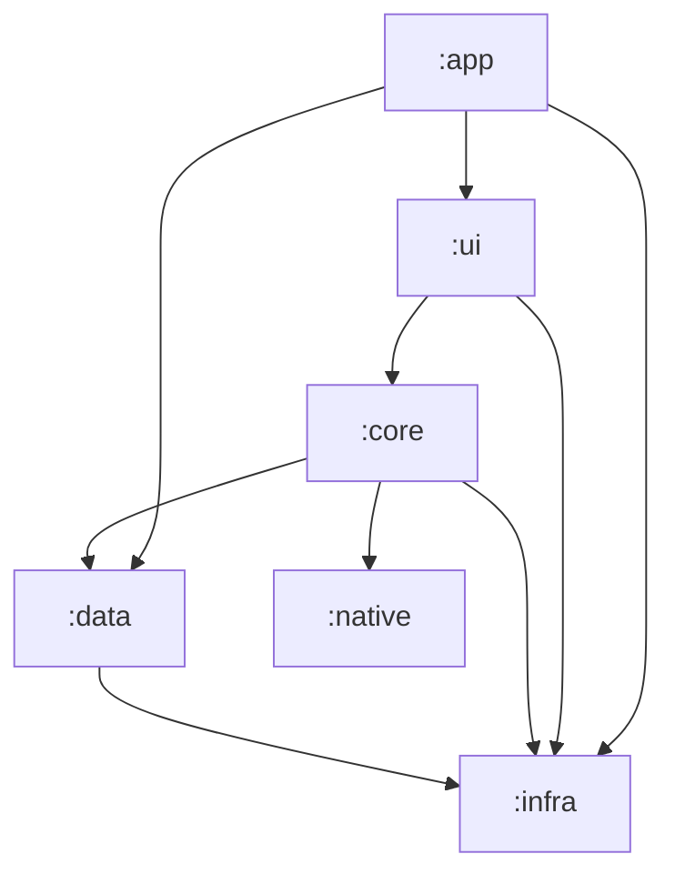

<script>
	import Callout from '$lib/mdsvex/callout.svelte';
</script>

<Callout type="note" title="No dedicated contribution guide yet">

Android doesn't have its own `CONTRIBUTING.md` yet like Desktop and P2P do — open an issue before sending a larger PR.

</Callout>

`acerola/android` is a native app in **Kotlin + Jetpack Compose**, organized into 6 Gradle modules.

## Running it

```bash
# Build
./gradlew assembleDebug
./gradlew assembleRelease
./gradlew installDebug

# Clean and build
./gradlew clean build
```

## Module architecture



- **`:infra`** — base layer, no internal dependencies: config, error handling, logging, shared patterns and utilities.
- **`:data`** — data access: adapters/gateways (Port & Adapter pattern, using Arrow's `Either` for errors), DTOs, Room (local DAOs/entities), and remote clients (MangaDex, AniList). Depends only on `:infra`.
- **`:native`** — Kotlin/JNI bridge (via `uniffi`) to consume `lib/p2p` (Rust) — loads the native libraries under `jniLibs/`. Base layer, no internal dependencies.
- **`:core`** — business logic and orchestration: DI modules (Hilt), use cases, P2P sync, and background workers (WorkManager). Depends on `:infra`, `:data`, and `:native`.
- **`:ui`** — Jetpack Compose: Screens, ViewModels, `UiState` classes, theming (Catppuccin, Dracula, Alucard, Nord), and navigation. Depends on `:core` and `:infra`.
- **`:app`** — entry point: `AcerolaApplication` (Hilt, WorkManager, Coil setup), `MainActivity` (navigation host).

## Key patterns

- **UDF (Unidirectional Data Flow)**: user interaction → `Screen` dispatches an action → `ViewModel` calls a use case/repository → emits `UiState` (`StateFlow`) → UI recomposes.
- **Port & Adapter**: contracts (gateways/providers) live in `data/adapter/contract/`, implementations in the rest of `data/adapter/`.
- **Error handling**: Arrow's `Either<Error, Success>` throughout the data layer.
- **DI**: Hilt everywhere — `@HiltViewModel`, `@HiltAndroidApp`, `@Module`/`@Provides` modules.

## Code quality and testing

```bash
./gradlew ktlintCheck                       # Lint (ktlint, applied to every module)
./gradlew ktlintFormat                      # Auto-formats
./gradlew test                              # All unit tests
./gradlew :data:test                        # Single module
./gradlew :data:test --tests "*ClassName"   # Single test class
./gradlew connectedDebugAndroidTest         # Instrumented tests (device required)
./gradlew koverHtmlReport                   # Coverage report (Kover)
```

## Database and remote APIs

Room: `comic_directory`, `comic_remote_info`, `chapter_archive`, `chapter_remote_info`, `chapter_download_source`, `author`, `genre`, `cover`, `reading_history`, `chapter_read`.

Remote APIs: `https://api.mangadex.org` (REST via Retrofit/Moshi) and a GraphQL client via Apollo (AniList).

## JVM target

Every module compiles for **Java 21**.
