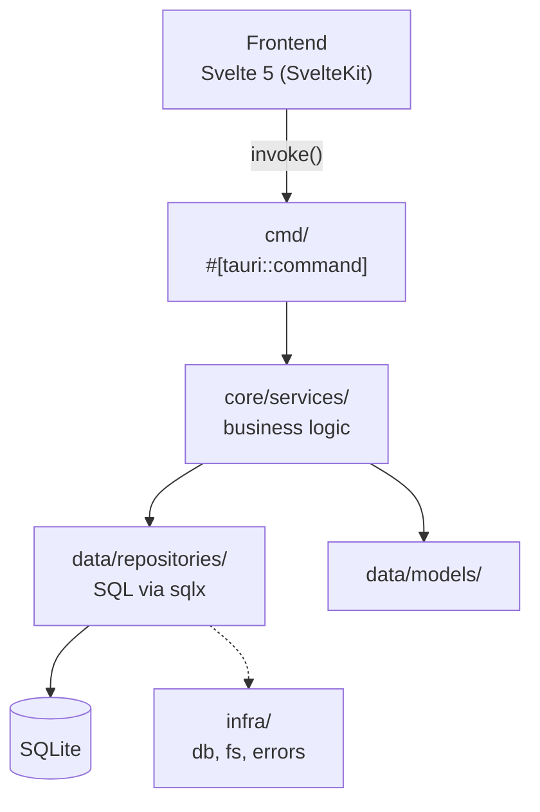

<script>
	import Callout from '$lib/components/acerola-callout/acerola-callout.svelte';
	import Steps from '$lib/mdsvex/steps.svelte';
</script>

`acerola/desktop` follows a two-layer architecture: a **backend** in Rust (Tauri), structured around Clean Architecture principles, and a reactive **frontend** in Svelte 5 (SvelteKit).

## Running it

<Steps>

1. Clone the repository and enter the desktop folder:

   ```bash
   git clone https://github.com/Vinicius-Gabriel-P-Leitao/acerola-reader
   cd acerola-reader/acerola/desktop
   ```

2. Install the frontend dependencies:

   ```bash
   npm install
   ```

3. Start the app through the Tauri CLI (builds the Rust backend and opens the app window):

   ```bash
   npm run tauri dev
   ```

</Steps>

## Backend architecture (`src-tauri/src/`)



- **`cmd/`** — all `#[tauri::command]`s, the entry point for the frontend. Never contains business logic or SQL: it only calls the services in `core/services`.
- **`core/services/`** — the app's business logic. Consolidates data (e.g. joining metadata with chapter counts) and returns safe structures to the frontend.
- **`data/models/`** — structs mapped to database tables/views (e.g. `ComicSummaryView`).
- **`data/repositories/`** — the only place SQL is written (via `sqlx`). Uses traits like `Entity` and `Bindable` to standardize CRUD.
- **`infra/`** — database config (`infra/db/migrations/`), filesystem handling, and error abstractions (`DbError`, `ComicError`).

## Frontend structure (`svelte/src/`)

- **`routes/`** — SvelteKit pages (`/home`, `/comic/[slug]`, `/reader`).
- **`lib/components/`** — reusable components from the project's own design system, prefixed `acerola-` (`acerola-button`, `acerola-input`, `acerola-card`).
- **`lib/hooks/store/`** — reactive state built with Svelte 5 runes (`$state`/`$effect`).
- **`lib/contracts/`** — types and Tauri IPC constants, so nothing is hardcoded between backend and frontend.
- **`lib/paraglide/`** — i18n; UI copy comes from here (`m['pages.home.loading']()`).

## Testing

| Layer | Command | What it covers |
| --- | --- | --- |
| Rust (unit) | `cargo test -p acerola` | Repositories, services |
| Frontend unit | `npm run test:unit` | jsdom + Testing Library — components, hooks, stores, utils |
| Frontend integration | runs alongside `npm run test` | Real browser (Playwright), for cases jsdom can't reproduce faithfully |
| Storybook | `npm run test:storybook` | Every story runs as a test, also in a real browser |
| E2E | `npm run test:e2e` | Playwright against `vite dev`, mocks Tauri's IPC |
| Coverage | `npm run test:coverage:unit` | Coverage for unit tests |
| Mutation | `npm run test:mutation` | Stryker — slow, runs weekly/manually in CI |

<Callout type="tip" title="Colocation convention">

Every component in `lib/components/` should have, in the same folder: `<name>.svelte` + `<name>.test.ts` + `<name>.stories.svelte`. The vendored shadcn-svelte components in `lib/components/ui/` are a deliberate exception — they don't get their own test/story.

</Callout>

## Strict rules

1. **SQL only in `data/repositories/`** — never in `cmd/` or `core/services/`.
2. **Reuse existing abstractions** — use the `comic_summary_view` view for Home listings; don't add models that break the `Entity` trait.
3. **Migrations are conservative** — don't alter existing migrations or make abrupt changes; use the matching consolidated file or build views for complex relational data.
4. **Language**: English is required for variable, class, struct, function, and file names. Portuguese is allowed only in comments explaining motivation and in test function names (`async fn teste_busca_por_titulo_lower_e_upper()`).
5. **Every new backend feature needs a unit test in the same file** (in the `mod tests` submodule).
