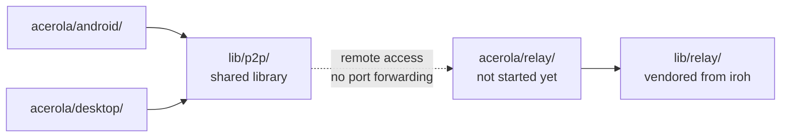

Acerola is a **monorepo**: each platform lives isolated under `acerola/`, with its own stack, its own README, and its own full contribution guide. No platform depends directly on another — they all consume the shared libraries in `lib/` via a local `path` dependency (not `git`), so a change in `lib/p2p/` already reflects in every consumer without publishing or updating anything elsewhere.

<CardGrid>
	<Card title="acerola/android">Kotlin + Jetpack Compose</Card>
	<Card title="acerola/desktop">Rust + Tauri + Svelte 5</Card>
	<Card title="acerola/relay">Remote access service (Rust) — not started yet</Card>
	<Card title="lib/p2p">Shared P2P library (iroh / QUIC)</Card>
	<Card title="lib/relay">Vendored iroh relay code</Card>
</CardGrid>

`acerola/android/` and `acerola/desktop/` never see each other directly — each implements its own FFI/binding to consume `lib/p2p/`. All communication between devices is either direct P2P (LAN via mDNS) or through the relay (`acerola/relay/`, built on top of `lib/relay/`) when devices aren't on the same network.

## Tools you need

[`cargo-make`](https://github.com/sagiegurari/cargo-make) (`cargo install cargo-make`) is used by the individual Rust crates — see each platform's guide — and by the maintenance tasks for the whole monorepo, defined in the root `Makefile.toml`. With it installed, `cargo make clean` removes the `target/` directory of every Rust crate in the repo (`lib/p2p`, `lib/relay`, `acerola/desktop/src-tauri`, `acerola/android/native/rust`) in one go.

## Rules that apply to the whole monorepo

- **One platform per PR**: a PR should touch a single platform (`acerola/android/`, `acerola/desktop/`, `acerola/relay/`, `lib/p2p/` or `lib/relay/`), except for changes that are genuinely shared (root docs, `LICENSE`, `PRIVACY_POLICY.md`).
- **Commit convention**: `[tag](platform): description`, e.g. `[fix](desktop): fix connection leak in the reader`. `tag` follows the prefixes `feat`, `fix`, `docs`, `refactor`, `test`, `chore`, `ci`, `merge`; `platform` is `android`, `desktop`, `p2p`, `relay` (for `acerola/relay/`), `relay-lib` (for `lib/relay/`) or `monorepo` for root-level changes.
- **Tests**: each platform has its own runner and its own automation via `cargo-make`/Gradle/Vitest — check the platform-specific guide before running tests manually.
- **`lib/p2p` is a local `path` dependency**: `acerola/android` and `acerola/desktop` consume `lib/p2p` by relative path in `Cargo.toml`, not `git`. A change in `lib/p2p/` already applies to both consumers in the same PR.

<Callout type="note" title="Where to find each platform's guide">

The next pages in this section cover how to run and test each platform locally. For everything else (detailed code standards, full environment setup), the platform-specific guide is the source of truth.

</Callout>
