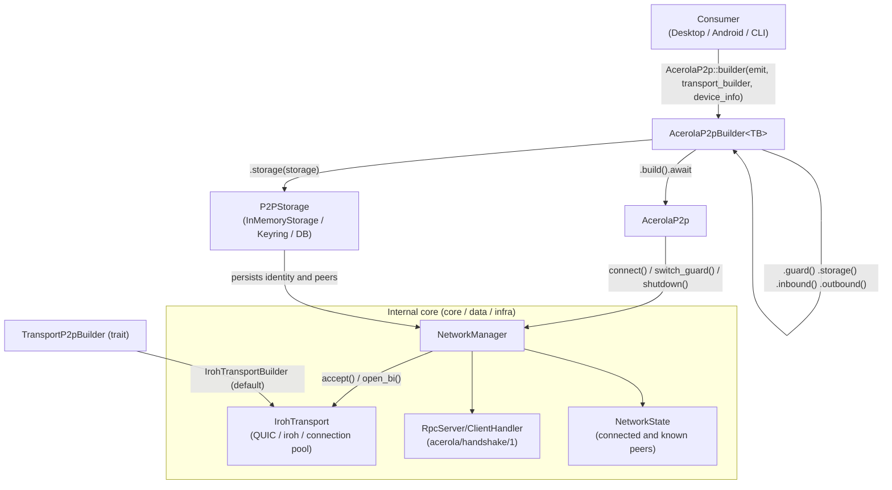
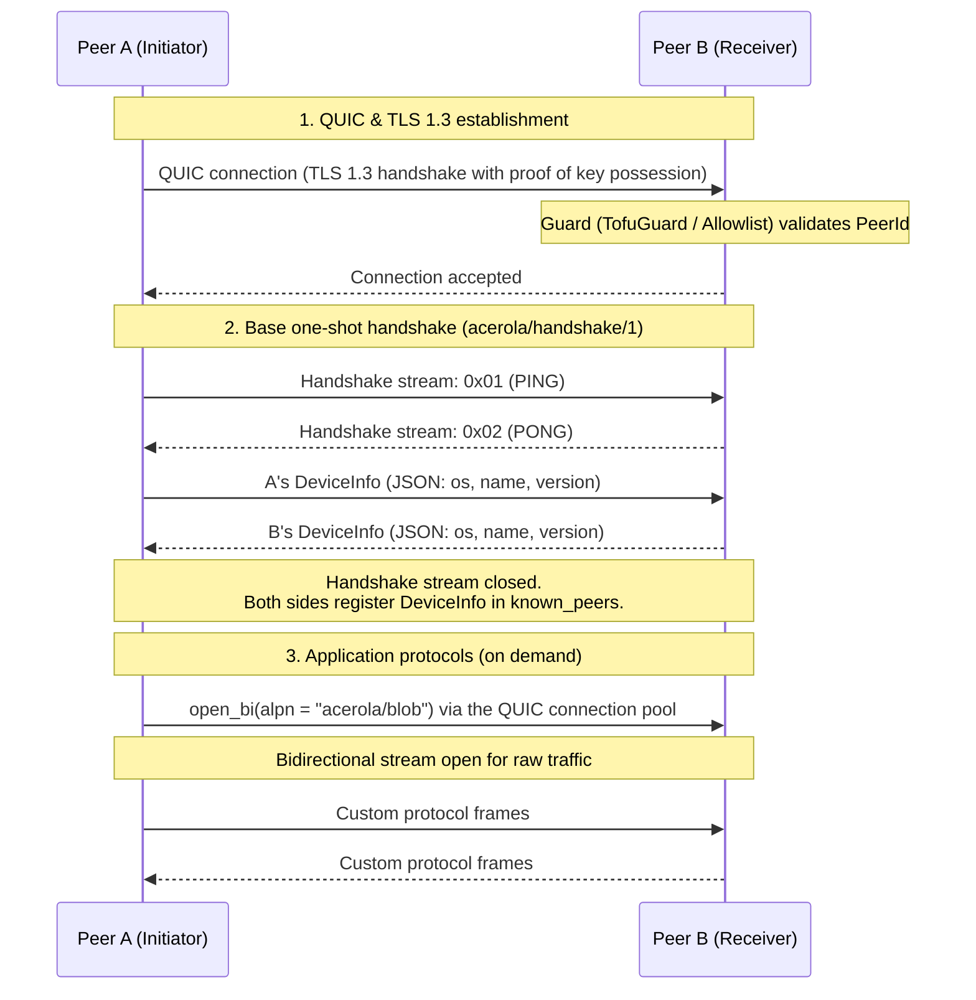

<script>
	import Callout from '$lib/components/acerola-callout/acerola-callout.svelte';
</script>

`lib/p2p` is the ecosystem's central P2P library, shared between Desktop and Android (iOS in the future). Built on [iroh](https://github.com/n0-computer/iroh) (QUIC / TLS 1.3) with the [Tokio](https://tokio.rs) async runtime.

<Callout type="note" title="No longer a separate repository">

This package's original `CONTRIBUTING.md` was written when `acerola-p2p` was a standalone repository. Today it lives in `lib/p2p/` inside the `acerola-reader` monorepo and is consumed via a local `path` dependency — there's no separate repo to clone.

</Callout>

## Running it

Prerequisites: Rust stable (2021 edition) and [`cargo-make`](https://github.com/sagiegurari/cargo-make) (`cargo install cargo-make`). `cargo-nextest` is recommended (`cargo install cargo-nextest`); the Android NDK is only needed for mobile cross-compilation.

```bash
# From the root of the acerola-reader monorepo
cd lib/p2p
cargo make check
```

## Build, lint, and test commands

| Command | Description |
| --- | --- |
| `cargo make check` | Checks that the code and tests compile |
| `cargo make build` | Builds the project in debug mode |
| `cargo make build-release` | Builds the library optimized for production |
| `cargo make format` | Applies formatting using `rustfmt.toml`'s rules |
| `cargo make lint` | Runs `clippy` with `-D warnings` |
| `cargo make test` | Runs the unit and integration test suite |
| `cargo make test-verbose` | Tests without capturing stdout |
| `cargo make test-stress` | Transport stress test (`transport_validation`) |
| `cargo make build-android-all` | Cross-compiles for Android (ARM64, ARMv7, x86_64) |
| `cargo make ci` | The full CI pipeline (check + lint + test-ci) |

## Architecture



The library decouples networking from application logic: Iroh QUIC is the default transport, but new implementations must respect the `TransportP2pBuilder` trait. `AcerolaP2p` instances are always built through `AcerolaP2pBuilder`, with Guards, Handlers, `EventEmitter`, and `DeviceInfo` all injectable.

## Connection and handshake lifecycle

The base handshake (`acerola/handshake/1`) is one-shot: it runs once on the initial connection to exchange device metadata and register the peer. Custom application protocols then travel over dedicated bidirectional streams, under their own ALPNs.



## Security model

Iroh runs over QUIC with TLS 1.3, so every node already cryptographically proves possession of its `NodeId`'s private key during the TLS handshake — the `peer_id` that reaches the `Guard` is already authenticated by the transport itself. No manual challenge/response protocol is needed. `TofuGuard` (Trust On First Use) acts on top of that already-proven identity: it registers automatically on first contact and validates persistently on subsequent connections.

## Code standards

- Run `cargo make format` before opening a PR (`rustfmt.toml`: `max_width = 100`, imports reordered via `StdExternalCrate`).
- All code must pass Clippy with no warnings (`cargo make lint`).
- Infrastructure and transport errors use `thiserror`, exported as `P2pError`. Avoid `.unwrap()`/`.expect()` in production code.

For the full API reference (builder, blobs, handlers, guards) with code examples, see the [package's README on GitHub](https://github.com/Vinicius-Gabriel-P-Leitao/acerola-reader/blob/main/lib/p2p/README.md).
