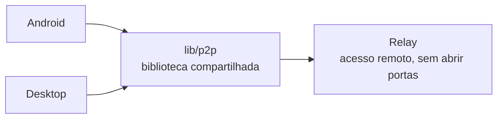
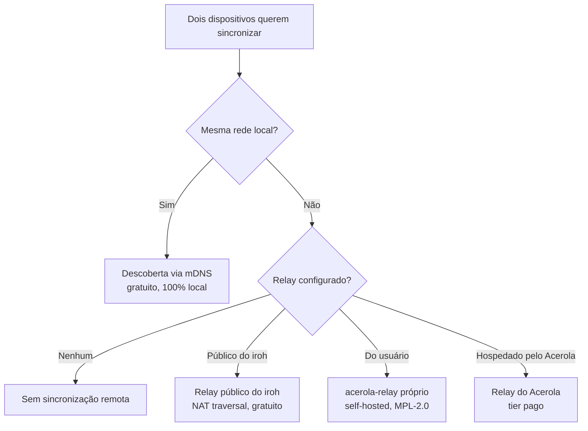

O Acerola é um **monorepo**: cada plataforma vive isolada, com sua própria stack, e nenhuma depende diretamente de outra. Todas consomem as bibliotecas compartilhadas em `lib/` via dependência de caminho local — uma mudança em `lib/p2p/` já reflete direto nos consumidores.

<CardGrid>
	<Card title="acerola/android">Kotlin + Jetpack Compose</Card>
	<Card title="acerola/desktop">Rust + Tauri + Svelte 5</Card>
	<Card title="acerola/relay">Serviço de acesso remoto (Rust) — ainda não iniciado</Card>
	<Card title="lib/p2p">Biblioteca P2P compartilhada (iroh / QUIC)</Card>
	<Card title="lib/relay">Código do relay iroh vendorizado</Card>
</CardGrid>

## Como as peças se conectam

`acerola/android/` e `acerola/desktop/` nunca se enxergam diretamente — cada um implementa sua própria FFI/binding para consumir `lib/p2p/`. Toda comunicação entre dispositivos é P2P direta (LAN via mDNS) ou via relay quando fora da mesma rede.

## Como a sincronização funciona

A biblioteca, o histórico e o progresso de leitura sincronizam diretamente entre os dispositivos do usuário — sem conta e sem banco de dados central. A forma como a conexão acontece depende de onde os dispositivos estão e do que foi configurado:

Os quatro formatos de conexão:

<CardGrid>
	<Card title="Descoberta local (mDNS)">
		Padrão e gratuito. Os dispositivos se encontram sozinhos na mesma rede Wi-Fi/LAN — nenhum tráfego sai da rede local.
	</Card>
	<Card title="Relay público do iroh">
		Quando os dispositivos não estão na mesma rede, a infraestrutura pública do <a href="https://iroh.computer" target="_blank" rel="noopener noreferrer">iroh</a> viabiliza a conexão (NAT traversal). Só retransmite tráfego QUIC criptografado ponta a ponta — nunca vê o conteúdo.
	</Card>
	<Card title="Relay do próprio usuário">
		Qualquer um pode rodar sua própria instância do <code>acerola-relay</code> (open source, MPL-2.0) numa VPS própria. Nenhuma infraestrutura de terceiros entra na jogada.
	</Card>
	<Card title="Relay hospedado pelo Acerola">
		Alternativa paga em que a infraestrutura de relay é operada pelo time do Acerola — mesma garantia de criptografia ponta a ponta dos outros modos.
	</Card>
</CardGrid>

Nos quatro casos o handshake e o transporte são os mesmos (QUIC + TLS 1.3 via iroh) — só muda quem intermedeia a conexão quando os dispositivos não estão na mesma rede. Detalhes sobre quais metadados cada modo expõe estão na [Política de Privacidade](/docs/privacy-policy).
