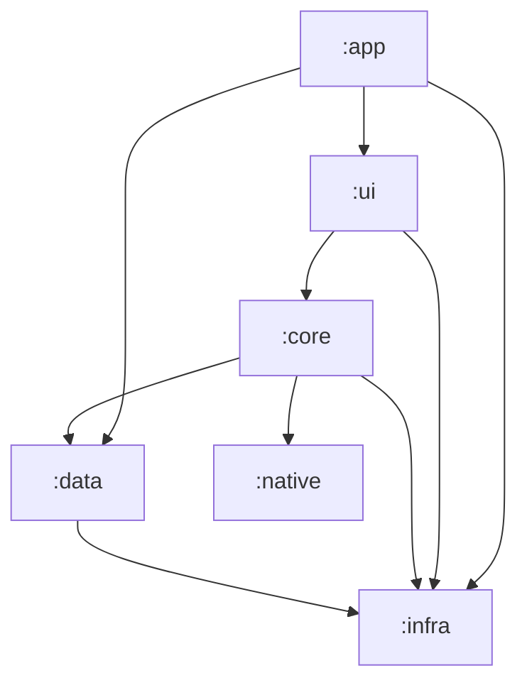

<script>
	import Callout from '$lib/mdsvex/callout.svelte';
</script>

<Callout type="note" title="Sem guia de contribuição dedicado ainda">

O Android ainda não tem um `CONTRIBUTING.md` próprio como Desktop e P2P têm — abra uma issue antes de mandar um PR maior.

</Callout>

O `acerola/android` é um app nativo em **Kotlin + Jetpack Compose**, organizado em 6 módulos Gradle.

## Como rodar

```bash
# Build
./gradlew assembleDebug
./gradlew assembleRelease
./gradlew installDebug

# Limpar e buildar
./gradlew clean build
```

## Arquitetura dos módulos



- **`:infra`** — camada base, sem dependências internas: configuração, tratamento de erro, logging, padrões e utilitários compartilhados.
- **`:data`** — acesso a dados: adapters/gateways (padrão Port & Adapter, com `Either` do Arrow para erro), DTOs, Room (DAO/entidades locais) e clientes remotos (MangaDex, AniList). Depende só de `:infra`.
- **`:native`** — ponte Kotlin/JNI (via `uniffi`) para consumir `lib/p2p` (Rust) — carrega as bibliotecas nativas em `jniLibs/`. Camada base, sem dependências internas.
- **`:core`** — regra de negócio e orquestração: módulos de DI (Hilt), use cases, sincronização P2P e workers em background (WorkManager). Depende de `:infra`, `:data` e `:native`.
- **`:ui`** — Jetpack Compose: Screens, ViewModels, classes `UiState`, temas (Catppuccin, Dracula, Alucard, Nord) e navegação. Depende de `:core` e `:infra`.
- **`:app`** — ponto de entrada: `AcerolaApplication` (Hilt, WorkManager, Coil), `MainActivity` (navigation host).

## Padrões principais

- **UDF (Unidirectional Data Flow)**: interação do usuário → `Screen` despacha ação → `ViewModel` chama use case/repositório → emite `UiState` (`StateFlow`) → UI recompõe.
- **Port & Adapter**: contratos (gateways/providers) em `data/adapter/contract/`, implementações nos demais pacotes de `data/adapter/`.
- **Tratamento de erro**: `Either<Error, Success>` do Arrow na camada de dados.
- **DI**: Hilt em todo o app — `@HiltViewModel`, `@HiltAndroidApp`, módulos `@Module`/`@Provides`.

## Qualidade de código e testes

```bash
./gradlew ktlintCheck                       # Lint (ktlint, aplicado em todos os módulos)
./gradlew ktlintFormat                      # Formata automaticamente
./gradlew test                              # Todos os testes unitários
./gradlew :data:test                        # Um módulo específico
./gradlew :data:test --tests "*ClassName"   # Uma classe de teste específica
./gradlew connectedDebugAndroidTest         # Testes instrumentados (precisa de device)
./gradlew koverHtmlReport                   # Relatório de cobertura (Kover)
```

## Banco de dados e APIs remotas

Room: `comic_directory`, `comic_remote_info`, `chapter_archive`, `chapter_remote_info`, `chapter_download_source`, `author`, `genre`, `cover`, `reading_history`, `chapter_read`.

APIs remotas: `https://api.mangadex.org` (REST via Retrofit/Moshi) e um client GraphQL via Apollo (AniList).

## Target de JVM

Todos os módulos compilam para **Java 21**.
