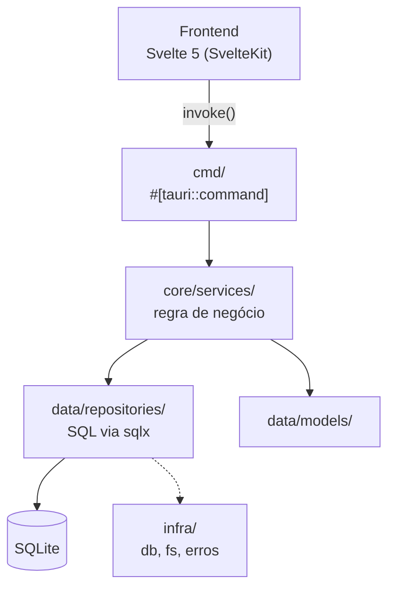

<script>
	import Callout from '$lib/mdsvex/callout.svelte';
	import Steps from '$lib/mdsvex/steps.svelte';
</script>

O `acerola/desktop` adota uma arquitetura em duas camadas: um **backend** em Rust (Tauri), estruturado com princípios de Clean Architecture, e um **frontend** reativo em Svelte 5 (SvelteKit).

## Como rodar

<Steps>

1. Clone o repositório e entre na pasta do desktop:

   ```bash
   git clone https://github.com/Vinicius-Gabriel-P-Leitao/acerola-reader
   cd acerola-reader/acerola/desktop
   ```

2. Instale as dependências do frontend:

   ```bash
   npm install
   ```

3. Suba o app pelo Tauri CLI (compila o backend Rust e abre a janela do app):

   ```bash
   npm run tauri dev
   ```

</Steps>

## Arquitetura do backend (`src-tauri/src/`)



- **`cmd/`** — todos os `#[tauri::command]`, a porta de entrada para o frontend. Nunca tem regra de negócio nem SQL: só chama os serviços de `core/services`.
- **`core/services/`** — a regra de negócio do app. Consolida dados (ex.: juntar metadados com contagem de capítulos) e retorna estruturas seguras para o frontend.
- **`data/models/`** — structs mapeadas para as tabelas/views do banco (ex.: `ComicSummaryView`).
- **`data/repositories/`** — os únicos lugares onde SQL é escrito (via `sqlx`). Usa traits como `Entity` e `Bindable` pra padronizar CRUD.
- **`infra/`** — configuração de banco (`infra/db/migrations/`), sistema de arquivos e abstrações de erro (`DbError`, `ComicError`).

## Estrutura do frontend (`svelte/src/`)

- **`routes/`** — páginas SvelteKit (`/home`, `/comic/[slug]`, `/reader`).
- **`lib/components/`** — componentes reusáveis do design system próprio, prefixo `acerola-` (`acerola-button`, `acerola-input`, `acerola-card`).
- **`lib/hooks/store/`** — estado reativo com Runes (`$state`/`$effect`) do Svelte 5.
- **`lib/contracts/`** — tipagens e constantes de IPC do Tauri, pra não haver hardcode entre backend e frontend.
- **`lib/paraglide/`** — i18n; os textos da UI vêm daqui (`m['pages.home.loading']()`).

## Testando

| Camada | Comando | O que cobre |
| --- | --- | --- |
| Rust (unit) | `cargo test -p acerola` | Repositórios, services |
| Frontend unit | `npm run test:unit` | jsdom + Testing Library — componentes, hooks, stores, utils |
| Frontend integration | roda junto de `npm run test` | Browser real (Playwright), casos que o jsdom não reproduz fielmente |
| Storybook | `npm run test:storybook` | Toda story roda como teste, também em browser real |
| E2E | `npm run test:e2e` | Playwright contra o `vite dev`, mocka o IPC do Tauri |
| Cobertura | `npm run test:coverage:unit` | Cobertura dos testes unit |
| Mutação | `npm run test:mutation` | Stryker — lento, roda semanal/manual no CI |

<Callout type="tip" title="Convenção de colocation">

Todo componente em `lib/components/` deve ter, na mesma pasta: `<nome>.svelte` + `<nome>.test.ts` + `<nome>.stories.svelte`. Os componentes vendorizados do shadcn-svelte em `lib/components/ui/` são exceção deliberada — não recebem teste/story próprios.

</Callout>

## Regras estritas

1. **SQL só em `data/repositories/`** — nunca em `cmd/` ou `core/services/`.
2. **Reaproveite as abstrações existentes** — use a view `comic_summary_view` pra iterar na Home; não crie models que desrespeitem a trait `Entity`.
3. **Migrations são conservadoras** — não altere migrations existentes nem crie mudanças abruptas; use o arquivo consolidado correspondente ou construa views para dados relacionais complexos.
4. **Idioma**: inglês obrigatório para nomes de variáveis, classes, structs, funções e arquivos. Português é permitido só em comentários explicando motivação e em nomes de funções de teste (`async fn teste_busca_por_titulo_lower_e_upper()`).
5. **Toda funcionalidade nova no backend precisa de teste unitário no mesmo arquivo** (submódulo `mod tests`).
