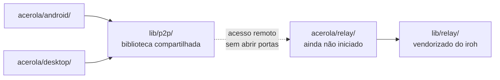

O Acerola é um **monorepo**: cada plataforma vive isolada em `acerola/`, com sua própria stack, seu próprio README e seu próprio guia de contribuição completo. Nenhuma plataforma depende diretamente de outra — todas consomem as bibliotecas compartilhadas em `lib/` via dependência `path` local (não `git`), então uma mudança em `lib/p2p/` já reflete direto nos consumidores sem precisar publicar ou atualizar nada em outro lugar.

<CardGrid>
	<Card title="acerola/android">Kotlin + Jetpack Compose</Card>
	<Card title="acerola/desktop">Rust + Tauri + Svelte 5</Card>
	<Card title="acerola/relay">Serviço de acesso remoto (Rust) — ainda não iniciado</Card>
	<Card title="lib/p2p">Biblioteca P2P compartilhada (iroh / QUIC)</Card>
	<Card title="lib/relay">Código do relay iroh vendorizado</Card>
</CardGrid>

`acerola/android/` e `acerola/desktop/` nunca se enxergam diretamente — cada um implementa sua própria FFI/binding para consumir `lib/p2p/`. Toda comunicação entre dispositivos é P2P direta (LAN via mDNS) ou via o relay (`acerola/relay/`, construído sobre `lib/relay/`) quando fora da mesma rede.

## Ferramentas necessárias

[`cargo-make`](https://github.com/sagiegurari/cargo-make) (`cargo install cargo-make`) é usado pelos crates Rust individualmente — veja o guia de cada plataforma — e pelas tarefas de manutenção do monorepo inteiro, definidas no `Makefile.toml` da raiz. Com ele instalado, `cargo make clean` remove o `target/` de todos os crates Rust do repo (`lib/p2p`, `lib/relay`, `acerola/desktop/src-tauri`, `acerola/android/native/rust`) de uma vez, sem precisar entrar em cada pasta.

## Regras que valem para o monorepo inteiro

- **Escopo por PR**: um PR deve tocar uma única plataforma (`acerola/android/`, `acerola/desktop/`, `acerola/relay/`, `lib/p2p/` ou `lib/relay/`), salvo mudanças de fato compartilhadas (docs raiz, `LICENSE`, `PRIVACY_POLICY.md`).
- **Convenção de commit**: `[tag](plataforma): descrição`, por exemplo `[fix](desktop): corrige leak de conexão no reader`. O `tag` segue os prefixos `feat`, `fix`, `docs`, `refactor`, `test`, `chore`, `ci`, `merge`; a `plataforma` é `android`, `desktop`, `p2p`, `relay` (para `acerola/relay/`), `relay-lib` (para `lib/relay/`) ou `monorepo` para mudanças na raiz.
- **Testes**: cada plataforma tem seu próprio runner e sua própria automação via `cargo-make`/Gradle/Vitest — veja o guia específico antes de rodar testes manualmente.
- **`lib/p2p` é dependência `path` local**: `acerola/android` e `acerola/desktop` consomem `lib/p2p` por caminho relativo no `Cargo.toml`, não por `git`. Uma mudança em `lib/p2p/` já vale pros dois consumidores no mesmo PR.

<Callout type="note" title="Onde encontrar o guia de cada plataforma">

As próximas páginas desta seção cobrem como rodar e testar cada plataforma localmente. Para o resto (padrões de código detalhados, setup completo do ambiente), o guia específico de cada plataforma é a fonte de verdade.

</Callout>
