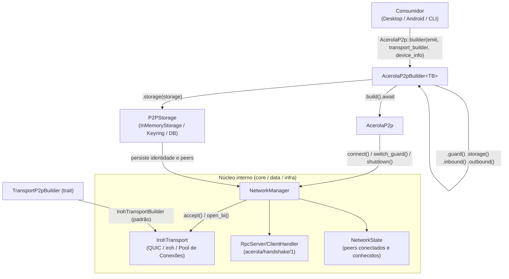
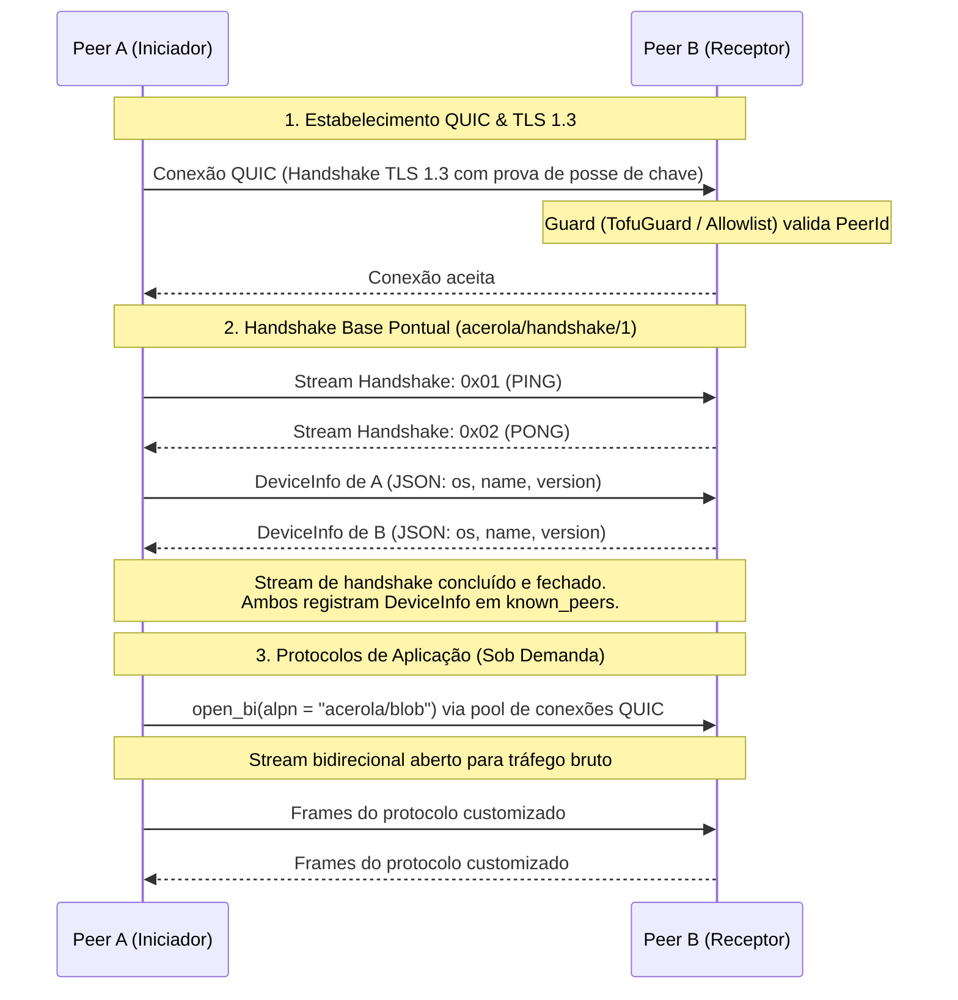

<script>
	import Callout from '$lib/mdsvex/callout.svelte';
</script>

`lib/p2p` é a biblioteca P2P central do ecossistema, compartilhada entre Desktop e Android (futuramente iOS). Construída sobre [iroh](https://github.com/n0-computer/iroh) (QUIC / TLS 1.3) com runtime assíncrono [Tokio](https://tokio.rs).

<Callout type="note" title="Não é mais um repositório separado">

O `CONTRIBUTING.md` original deste pacote foi escrito quando `acerola-p2p` era um repositório standalone. Hoje ele vive em `lib/p2p/` dentro do monorepo `acerola-reader` e é consumido por dependência `path` local — não precisa clonar nada separadamente.

</Callout>

## Como rodar

Pré-requisitos: Rust stable (edição 2021) e [`cargo-make`](https://github.com/sagiegurari/cargo-make) (`cargo install cargo-make`). `cargo-nextest` é recomendado (`cargo install cargo-nextest`); o NDK do Android só é necessário para compilação cruzada mobile.

```bash
# A partir da raiz do monorepo acerola-reader
cd lib/p2p
cargo make check
```

## Comandos de build, lint e teste

| Comando | Descrição |
| --- | --- |
| `cargo make check` | Verifica se o código e os testes compilam |
| `cargo make build` | Compila o projeto em modo debug |
| `cargo make build-release` | Compila a biblioteca otimizada para produção |
| `cargo make format` | Aplica formatação com as regras do `rustfmt.toml` |
| `cargo make lint` | Executa o `clippy` com `-D warnings` |
| `cargo make test` | Executa a suíte de testes unitários e de integração |
| `cargo make test-verbose` | Testes sem capturar a saída padrão |
| `cargo make test-stress` | Teste de estresse de transporte (`transport_validation`) |
| `cargo make build-android-all` | Cross-compilação para Android (ARM64, ARMv7, x86_64) |
| `cargo make ci` | Pipeline completa de CI (check + lint + test-ci) |

## Arquitetura



A biblioteca desacopla rede da lógica de aplicação: o Iroh QUIC é o transporte padrão, mas novas implementações devem respeitar a trait `TransportP2pBuilder`. Instâncias de `AcerolaP2p` são sempre construídas via `AcerolaP2pBuilder`, com Guards, Handlers, `EventEmitter` e `DeviceInfo` injetáveis.

## Ciclo de conexão e handshake

O handshake base (`acerola/handshake/1`) é pontual (*one-shot*): roda uma única vez na conexão inicial para trocar metadados do dispositivo e registrar o peer. Protocolos de aplicação customizados trafegam depois em streams bidirecionais dedicados, sob seus próprios ALPNs.



## Modelo de segurança

O Iroh opera sobre QUIC com TLS 1.3, então cada nó já prova criptograficamente a posse da chave privada do seu `NodeId` durante o handshake TLS — o `peer_id` que chega ao `Guard` já é autenticado pelo transporte. Não é preciso criar protocolos manuais de desafio/resposta. O `TofuGuard` (Trust On First Use) atua sobre essa identidade já comprovada: registra automaticamente no primeiro contato e valida persistentemente nas conexões seguintes.

## Padrões de código

- Rode `cargo make format` antes de abrir um PR (`rustfmt.toml`: `max_width = 100`, imports reordenados por `StdExternalCrate`).
- Todo código precisa passar no Clippy sem avisos (`cargo make lint`).
- Erros de infraestrutura e transporte usam `thiserror`, exportados como `P2pError`. Evite `.unwrap()`/`.expect()` em código de produção.

Para a referência completa da API (builder, blobs, handlers, guards) com exemplos de código, veja o [README do pacote no GitHub](https://github.com/Vinicius-Gabriel-P-Leitao/acerola-reader/blob/main/lib/p2p/README.md).
