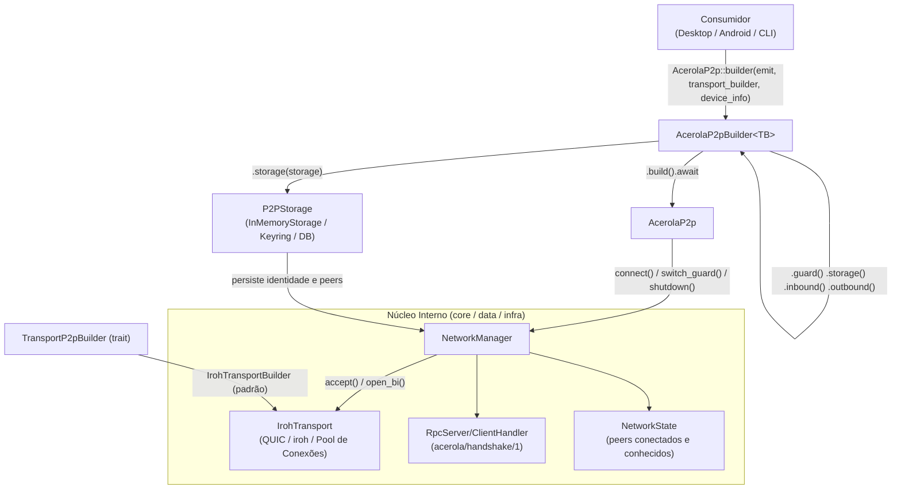
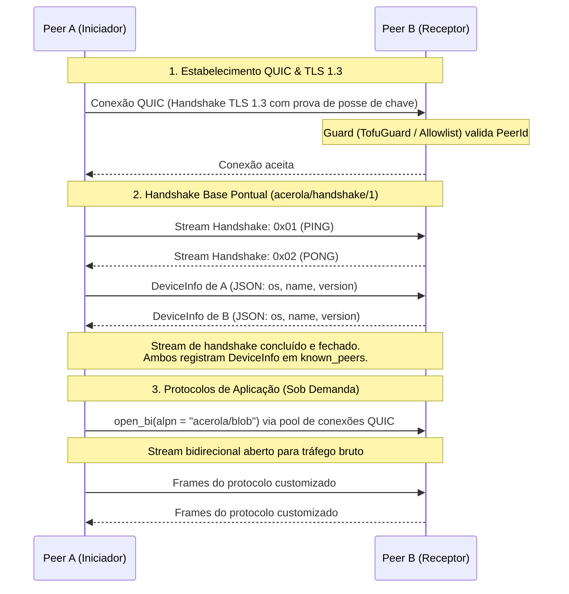

# acerola-p2p

Biblioteca P2P central do ecossistema Acerola. Compartilhada entre desktop e Android (futuramente iOS). Construída sobre [iroh](https://github.com/n0-computer/iroh) (QUIC / TLS 1.3) com runtime assíncrono [Tokio](https://tokio.rs).

---

## Arquitetura



---

## Ciclo de Conexão e Handshake

O handshake base (`acerola/handshake/1`) é pontual (*one-shot*): é executado uma única vez na conexão inicial para trocar metadados do dispositivo e registrar o peer no estado. Protocolos de aplicação customizados trafegam em streams bidirecionais dedicados sob seus próprios ALPNs.



---

## Instalação

Adicione ao seu `Cargo.toml`:

```toml
[dependencies]
acerola-p2p = { git = "https://github.com/Vinicius-Gabriel-P-Leitao/acerola-p2p" }
```

---

## Uso Básico

### Inicialização Mínima

```rust
use std::sync::Arc;
use acerola_p2p::api::{
    AcerolaP2p,
    identity::DeviceInfo,
    protocol::EventEmitter,
    transport::IrohTransportBuilder,
};

#[tokio::main]
async fn main() -> Result<(), Box<dyn std::error::Error>> {
    let emit: EventEmitter = Arc::new(|event, data| {
        println!("[{event}] {data}");
    });

    let device_info = DeviceInfo {
        name: "meu-dispositivo".to_string(),
        os: "linux".to_string(),
        version: "1.0.0".to_string(),
    };

    let node = AcerolaP2p::builder(emit, IrohTransportBuilder::default(), device_info)
        .build()
        .await?;

    println!("ID do nó local: {}", node.local_id());
    if let Some(device_id) = node.local_device_id() {
        println!("UUID determinístico do dispositivo: {}", device_id);
    }

    Ok(())
}
```

---

## Configurações Avançadas do Builder

### 1. Relays e Seed Criptográfica Fixa

Por padrão, sem relays configurados, o nó descobre outros nós via mDNS na rede local (`RelayMode::Disabled`). É possível configurar relays remotos e fixar a seed de identidade:

```rust
use acerola_p2p::api::transport::IrohTransportBuilder;

let seed = [0x42u8; 32]; // 32 bytes para identidade persistente
let transport_builder = IrohTransportBuilder::default()
    .relay("https://relay.exemplo.com")
    .seed(seed);

let node = AcerolaP2p::builder(emit, transport_builder, device_info)
    .build()
    .await?;
```

#### Modos de relay (`RelayModeConfig`)

Para uma escolha explícita entre os modos de relay suportados — em vez de inferir o modo a
partir de haver ou não uma URL configurada — use `.relay_mode(...)`, que tem prioridade sobre
`.relay(url)` caso ambos sejam chamados:

```rust
use acerola_p2p::api::transport::{IrohTransportBuilder, RelayModeConfig};

// Sem relay remoto — só descoberta mDNS na rede local (offline/alta privacidade).
let mdns_only = IrohTransportBuilder::default().relay_mode(RelayModeConfig::MdnsOnly);

// Relay(s) customizado(s), informado(s) pelo app consumidor.
let custom = IrohTransportBuilder::default()
    .relay_mode(RelayModeConfig::Custom(vec!["https://meu-relay.exemplo.com".to_string()]));

// Relay oficial mantido pelo ecossistema Acerola (`ACEROLA_DEFAULT_RELAY_URL`).
let acerola_own = IrohTransportBuilder::default().relay_mode(RelayModeConfig::AcerolaOwn);

// Rede pública de relays padrão do projeto Iroh (produção n0).
let iroh_default = IrohTransportBuilder::default().relay_mode(RelayModeConfig::IrohDefault);
```

Só afeta o momento de montar o node (builder) — trocar o modo em runtime, com o node já rodando, não é suportado.

### 2. Persistência de Identidade e Cache de Peers (`P2PStorage`)

Ao fornecer um storage, o builder sincroniza e restaura automaticamente a chave mestra de identidade e o cache de endereços de peers para reconexão/bootstrapping rápido:

```rust
use acerola_p2p::api::storage::InMemoryStorage;

let storage = InMemoryStorage::new();

let node = AcerolaP2p::builder(emit, IrohTransportBuilder::default(), device_info)
    .storage(storage)
    .build()
    .await?;
```

### 3. Blobs — Storage Content-Addressed (`iroh-blobs-adapter`)

Atrás da feature `iroh-blobs-adapter` (ativa `iroh` automaticamente), o `IrohTransportBuilder` pode montar um store de blobs content-addressed (BLAKE3, dedup e download verificado via o motor real do [`iroh-blobs`](https://github.com/n0-computer/iroh-blobs)) sobre o mesmo `Endpoint` do transporte:

```toml
[dependencies]
acerola-p2p = { git = "https://github.com/Vinicius-Gabriel-P-Leitao/acerola-p2p", features = ["iroh-blobs-adapter"] }
```

```rust
use acerola_p2p::api::{transport::IrohTransportBuilder, blobs::IrohBlobsConfig};

// Store em memória (não sobrevive a reinícios, ideal para testes)
let transport_builder = IrohTransportBuilder::default().blobs(IrohBlobsConfig::mem());

// ...ou persistente em disco
let transport_builder = IrohTransportBuilder::default().blobs(IrohBlobsConfig::fs("./blobs"));

let node = AcerolaP2p::builder(emit, transport_builder, device_info)
    .build()
    .await?;
```

Sem `.blobs(...)` configurado (ou com um transporte que não suporte a capacidade), `node.blobs()` simplesmente retorna `None` — ver a seção [Blobs em Tempo de Execução](#blobs-em-tempo-de-execução) abaixo.

### 4. Provedores Nativos de Informações do Dispositivo

O módulo `identity` oferece provedores por plataforma com detecção automática de sistema operacional e hostname:

```rust
use acerola_p2p::api::identity::{DefaultDeviceInfoProvider, DeviceInfoProvider};

// Linux (lê /etc/hostname) e Windows (lê COMPUTERNAME)
let provider = DefaultDeviceInfoProvider::new("1.0.0");
let device_info = provider.provide()?;

// Android (requer nome explícito vindo do Kotlin/JNI)
// let provider = DefaultDeviceInfoProvider::new("Galaxy S23", "1.0.0");
```

---

## Componentes Injetáveis

### `EventEmitter`

Callback assíncrono disparado a cada evento interno do sistema (notificações da UI no desktop via `app.emit()` ou chamadas JNI no Android):

```rust
let emit: EventEmitter = Arc::new(|event: &str, data: String| {
    // Eventos emitidos:
    // "rpc:ping_sent" | "rpc:pong_received"
    // "rpc:ping_received" | "rpc:pong_sent"
    // "rpc:device_info_sent" | "rpc:device_info_received" | "rpc:device_info_exchanged"
    // "network:latency"
    println!("[EVENTO] {event} -> {data}");
});
```

---

### `Handler` (`ProtocolHandler`)

Para registrar subprotocolos de aplicação sobre ALPNs customizados. Recebe streams de leitura e escrita brutos:

```rust
use std::sync::Arc;
use async_trait::async_trait;
use acerola_p2p::api::{
    error::P2pError,
    peer::PeerIdentity,
    protocol::Handler,
    transport::IrohTransportBuilder,
    AcerolaP2p,
};
use tokio::io::{AsyncRead, AsyncWrite, AsyncReadExt, AsyncWriteExt};

struct SyncHandler;

#[async_trait]
impl Handler for SyncHandler {
    async fn handle(
        &self,
        peer: &PeerIdentity,
        mut send: Box<dyn AsyncWrite + Send + Unpin>,
        mut recv: Box<dyn AsyncRead + Send + Unpin>,
    ) -> Result<(), P2pError> {
        send.write_all(b"sync-payload").await.map_err(|e| P2pError::StreamFailed(e.to_string()))?;
        send.shutdown().await.map_err(|e| P2pError::StreamFailed(e.to_string()))?;
        
        let mut buffer = Vec::new();
        recv.read_to_end(&mut buffer).await.map_err(|e| P2pError::StreamFailed(e.to_string()))?;
        Ok(())
    }
}

let node = AcerolaP2p::builder(emit, IrohTransportBuilder::default(), device_info)
    .inbound(b"acerola/sync/1", Arc::new(SyncHandler))  // Manipula conexões recebidas
    .outbound(b"acerola/sync/1", Arc::new(SyncHandler)) // Manipula conexões disparadas
    .build()
    .await?;
```

---

### `Guard` (`BoxedValidator`)

Middleware de firewall executado para validar toda nova tentativa de conexão entrante:

```rust
use acerola_p2p::api::{
    error::P2pError,
    guard::{Guard, OpenGuard, TofuGuard, InMemoryTrustedStore},
};

// 1. Aberto (padrão) — aceita qualquer peer
let guard_aberto: Guard = OpenGuard::into_validator();

// 2. TOFU (Trust On First Use) — aceita desconhecidos na 1ª vez e bloqueia maliciosos
let store = Arc::new(InMemoryTrustedStore::new());
store.block("peer-malicioso").await;
let guard_tofu: Guard = TofuGuard::new(store).into_validator();

// 3. Customizado / Allowlist estrita
let allowlist_guard: Guard = Box::new(|ctx| {
    let peer_id = ctx.peer_id.id.clone();
    Box::pin(async move {
        if peer_id == "peer-confiavel-id" {
            Ok(())
        } else {
            Err(P2pError::AuthDenied("peer não autorizado".into()))
        }
    })
});

let node = AcerolaP2p::builder(emit, IrohTransportBuilder::default(), device_info)
    .guard(guard_tofu)
    .build()
    .await?;
```

---

## Operações em Tempo de Execução (`AcerolaP2p`)

### Conexão e Discagem

```rust
// Dispara uma conexão contra o endereço de um peer no ALPN configurado
node.connect(peer_addr, b"acerola/sync/1").await?;
```

### Consultas de Estado e Peers

```rust
// Peers com sessões de protocolo de aplicação ativas no momento
let ativas = node.connected_peers().await;

// Peers já vistos com seu respectivo DeviceInfo (sobrevive ao fim do handshake)
let conhecidos = node.known_peers().await;
for (peer_id, addr, maybe_info) in conhecidos {
    println!("Peer: {} | Info: {:?}", peer_id.id, maybe_info);
}

// Verifica se há conexão física QUIC viva no pool de transporte
let online = node.is_peer_reachable(&peer_id).await;

// Modo operacional atual
let mode = node.mode().await;
```

### Troca Dinâmica de Guard e Modo de Rede

```rust
use acerola_p2p::api::network::NetworkMode;

// Atualiza o firewall e o modo de operação dinamicamente sem reiniciar o nó
node.switch_guard(novo_guard, NetworkMode::Relay).await?;
```

### Encerramento Gracioso

```rust
// Encerra os loops em background, fecha sockets e conexões QUIC
node.shutdown().await?;
```

---

## Blobs em Tempo de Execução

Com `.blobs(...)` configurado no builder (feature `iroh-blobs-adapter`, ver [Configurações Avançadas](#3-blobs--storage-content-addressed-iroh-blobs-adapter)), `node.blobs()` devolve a capacidade de armazenamento/transferência content-addressed:

```rust
use acerola_p2p::api::blobs::P2pBlobStore;
use tokio::io::AsyncReadExt;

// `None` se `.blobs(...)` não foi configurado no builder, ou se o transporte usado
// não suportar essa capacidade.
let Some(blobs) = node.blobs().await else {
    return Ok(());
};

// Armazena localmente — o hash retornado é content-addressed (BLAKE3)
let hash = blobs.put(b"conteudo qualquer".to_vec()).await?;

// Confirma presença local sem baixar o blob inteiro
assert!(blobs.has(&hash).await?);

// Lê de volta como stream
let mut reader = blobs.get(&hash).await?;
let mut bytes = Vec::new();
reader.read_to_end(&mut bytes).await?;

// Baixa um blob de um peer remoto específico (download real, verificado por hash)
blobs.fetch(&hash, &peer_addr).await?;

// Remove a tag local associada ao hash — a reclamação física do espaço acontece no
// próximo ciclo de garbage collection do store, não é imediata (ver nota abaixo)
blobs.remove(&hash).await?;
```

`BlobHash` é um wrapper opaco sobre 32 bytes (`Display`/`FromStr` em hex, `Serialize`/`Deserialize`), independente do tipo de hash usado internamente pelo adapter escolhido. `remove()` é "lógico": o `iroh-blobs` restringe deleção física de blob a garbage collection interno de propósito — `remove()` apaga a tag que protege o hash, e o GC (intervalo configurável em `IrohBlobsConfig`) reclama o espaço depois.

---

## TofuGuard e Modelo de Segurança com Iroh

Ao utilizar o `IrohTransport`:

1. **Autenticação de Transporte Nativa**: O Iroh opera sobre QUIC com **TLS 1.3**, onde cada nó prova criptograficamente a posse da chave privada do seu `NodeId` durante o handshake TLS. O `peer_id` que chega ao `Guard` já é autenticado pelo próprio transporte.
2. **Sem Challenge-Response Redundante**: Não é necessário criar protocolos manuais de desafio/resposta na aplicação; o handshake TLS 1.3 já cumpre esse papel com segurança formal.
3. **`TofuGuard`**: Atua como a política de confiança sobre a identidade já comprovada (verificação de blocklist, registro automático no primeiro contato e validação persistente nas conexões seguintes).

```
Conexão QUIC (Iroh)
  └── Handshake TLS 1.3          ← Prova criptográfica de chave privada (automático)
        └── Guard (Tofu / Custom) ← Validação de política sobre o PeerId autenticado
              └── Protocol Handler ← Tráfego seguro de dados da aplicação
```
